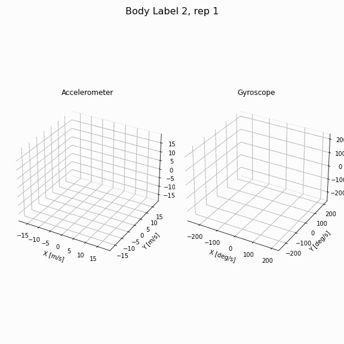
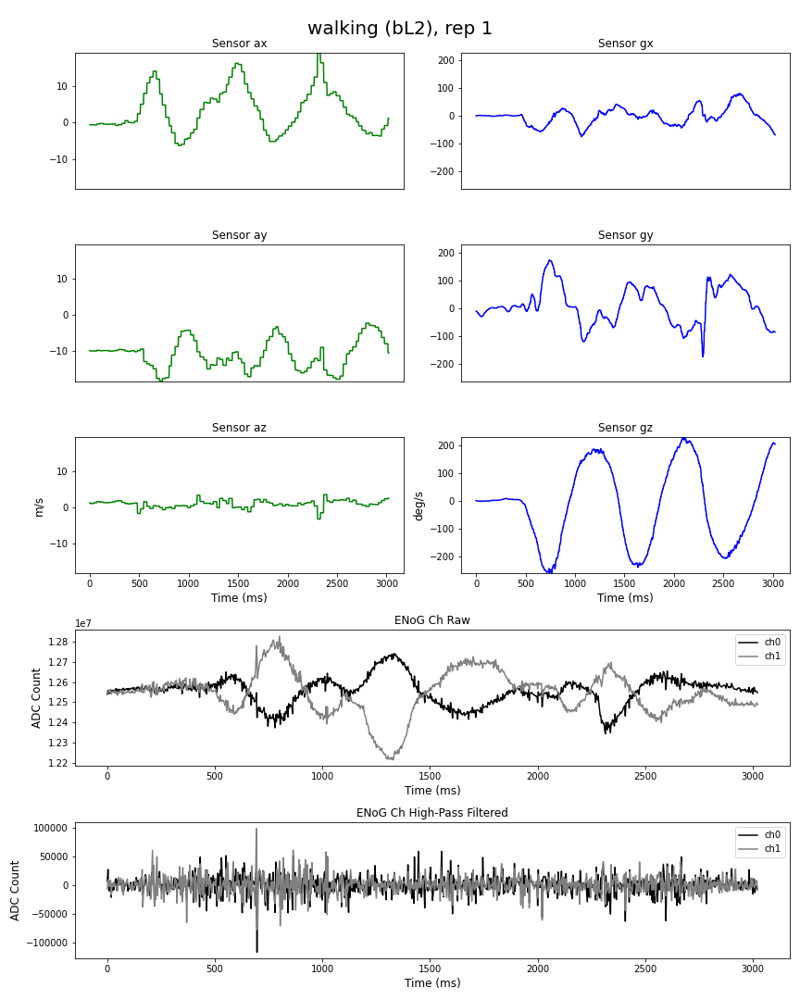
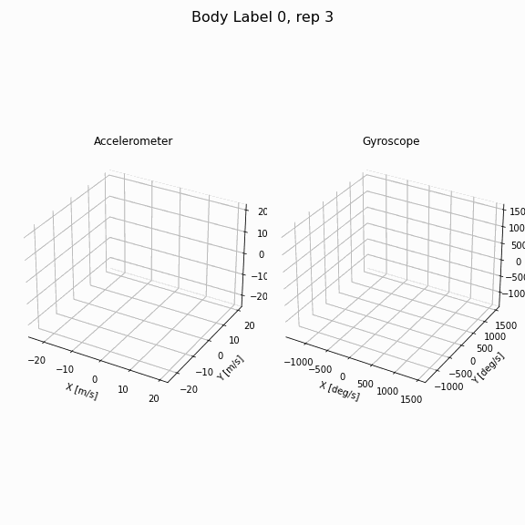
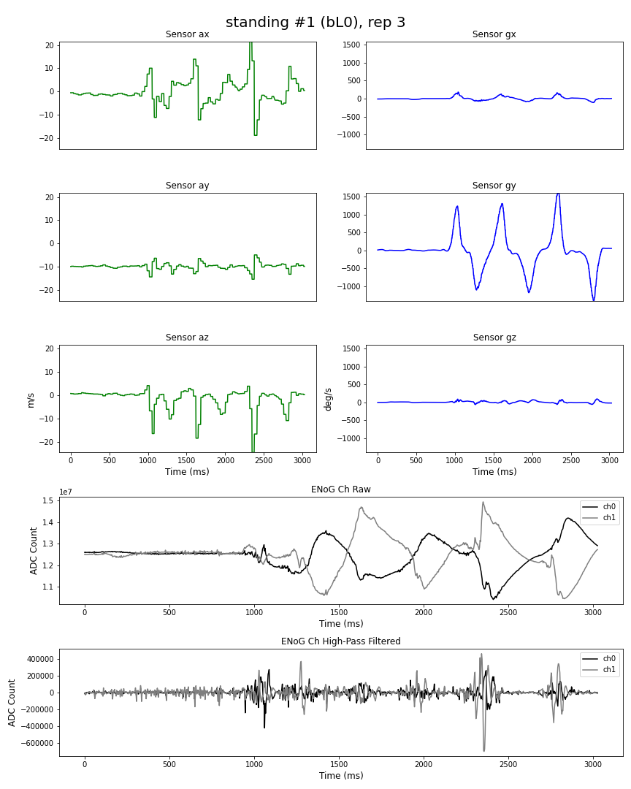
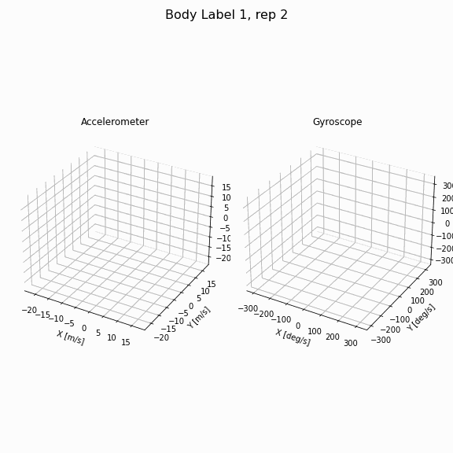
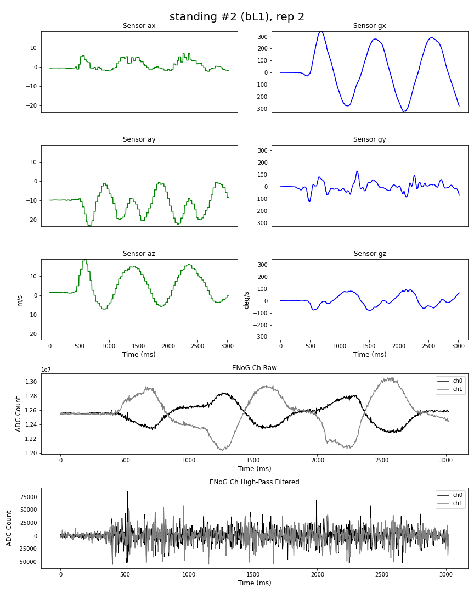

# Pison Data Science Technical Assessment
### Author: Dante J. Smith, PhD (djsmith@bu.edu)
## Intro
In consideration for the data scientist position at Pison, the technical assessment provides a sample data set collected from a Pison wrist device. The data set includes time-series recordings of the on-board sensors during a number of different recording tasks that vary both in body movement condition and trial repetition. The task is to build a classifier to identify the number of different wrist movement classes.  

This repo includes a Jupyter notebook of the coding process and prototyping that I attempted to solve this problem. This repo also includes PDFs of the initial assessment prompt, and my thought process for solving this prompt.  

## Solution
In total there are 15 wrist movements to identify, and therefore, no more than 15 different classes of wrist movements. It is extremely likely there are in fact less than 15.  

My solution returned **6 classes** of wrist movements. The Dataset Sample value defines the individual wrist movement recordings in each class, separated by semicolons. `BL` denotes the body movement label and `Rep` denotes the repetition number.

|  Class  |    Dataset Sample    | Description |
| ------- | -------------------- | ----------- |
|Class 0|	BL0, Rep1; BL1, Rep1; BL2, Rep1; BL3, Rep1|	Stirring Motion in X/Y Plane|
|Class 1|	BL0, Rep3; BL1, Rep3; BL2, Rep3; BL3, Rep3|	Cross Body Wave|
|Class 2|	BL4, Rep2|	Figure-8 trace in Y/Z Plane|
|Class 3|	BL0, Rep2; BL1, Rep2; BL2, Rep2; BL3, Rep2|	Figure-8 trace in Y/Z Plane|
|Class 4|	BL4, Rep3|	Cross Body Wave|
|Class 5|	BL4, Rep1|	Stirring Motion in X/Y Plane|

## Class Examples
It is quite difficult to give descriptions of the wrist movements simply by measuring or classifying the individual channel time-series data. It is more useful to take combinations of sensor recordings and display them in three-dimensional (3D) space to better approximate what the wrist device was doing in these recordings. Below are gifs exemplifying the movement classes.

### Class 0

### Class 1

### Class 3

## Final Thoughts
I have generated subplot figures of the features used to generate my model, as well as 3D animations of the accelerometer and gyroscope sensors. You can find those files in the folders of the repo titled *FeaturePlots* and *WristGifs* respectively. From visual inspection of the signals, it may stand to reason that there are only 3 classes of wrist movement instead of 6. It is certainly true that the wrist movements seem to cluster around the repetition number, with the repetitions of Body Movement 4 (Running) seemingly singled out. I could imagine a scenario where the running action created signal that was different enough from the other classes to generate their own cluster. 

## Questions
1. What are the differences between body movement labels 0 and 1 which are titled Standing #1 and Standing #2?
2. What type of sensors are channels 0 and 1, and where are they placed? Are they ENoG? What type of physiological characteristic are they meant to be targeting?
3. What is the oscillating signal that is being picked up in the raw ch0 and ch1? What is the high-pass filtered version telling us?
4. Having an on-board accelerometer and gyroscope make a lot of sense. The Quaternion recordings are somewhat new to me. Is this a separate sensor, or a combination of the recordings from accelerometer and gyroscope? Are these data sending the variations of the same information?